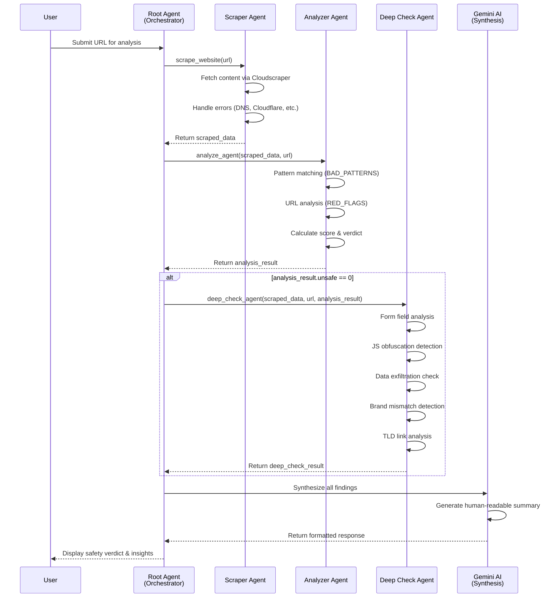
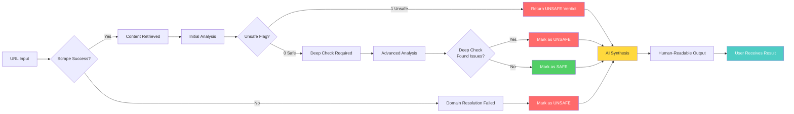
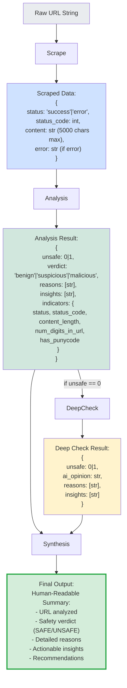
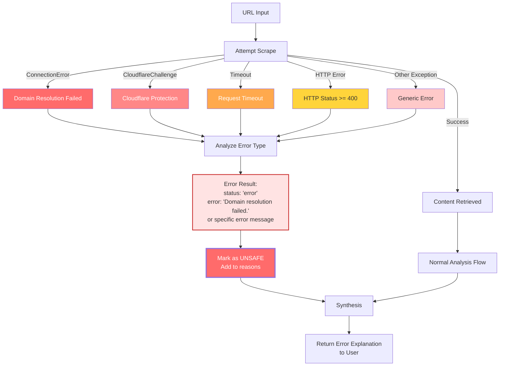

# Apex Data Flow Diagram

## System Architecture Flow

```mermaid
flowchart TD
    Start([User Input: URL]) --> RootAgent[Root Agent<br/>Gemini 2.5 Flash<br/>Orchestrator]
    
    RootAgent --> Scrape[Scrape Website Tool]
    Scrape --> CloudScraper[Cloudscraper<br/>Bypass Cloudflare]
    
    CloudScraper -->|Success| ScrapedData{Scraped Data<br/>Status: Success?}
    CloudScraper -->|Connection Error| DomainError[Domain Resolution Failed]
    CloudScraper -->|Cloudflare Challenge| CloudflareError[Cloudflare Protection]
    CloudScraper -->|Other Error| GenericError[Generic Error]
    
    DomainError --> ErrorResult[Error Result:<br/>status: error<br/>error: Domain resolution failed]
    CloudflareError --> ErrorResult
    GenericError --> ErrorResult
    
    ScrapedData -->|Yes| Content[Website Content<br/>Max 5000 chars]
    ScrapedData -->|No| ErrorResult
    
    Content --> Analyze[Analyze Agent Tool]
    
    Analyze --> PatternMatch[Pattern Matching Engine]
    PatternMatch --> BadPatterns[Check BAD_PATTERNS:<br/>seed phrase, private key,<br/>airdrop, free crypto, etc.]
    PatternMatch --> URLFlags[Check URL_RED_FLAGS:<br/>Suspicious TLDs, punycode]
    PatternMatch --> HTTPStatus[Check HTTP Status<br/>& Domain Resolution]
    
    BadPatterns --> Scoring[Scoring Algorithm]
    URLFlags --> Scoring
    HTTPStatus --> Scoring
    
    Scoring --> Verdict{Calculate Verdict:<br/>Score >= 4: Malicious<br/>Score >= 2: Suspicious<br/>Else: Benign}
    
    Verdict -->|Unsafe = 1| AnalysisResult[Analysis Result:<br/>unsafe: 1<br/>verdict: malicious/suspicious<br/>reasons: [...]<br/>insights: [...]]
    Verdict -->|Unsafe = 0| DeepCheck{Trigger Deep Check?}
    
    DeepCheck -->|Yes| DeepCheckTool[Deep Check Agent Tool]
    DeepCheck -->|No| AnalysisResult
    
    DeepCheckTool --> FormAnalysis[Form Field Analysis:<br/>Check for seed/mnemonic inputs]
    DeepCheckTool --> JSObfuscation[JS Obfuscation Detection:<br/>atob, eval, fromCharCode]
    DeepCheckTool --> DataExfil[Data Exfiltration Detection:<br/>fetch, xhr, sendbeacon]
    DeepCheckTool --> BrandMismatch[Brand Mismatch Detection:<br/>Compare domain vs content brands]
    DeepCheckTool --> TLDCheck[Suspicious TLD Link Analysis]
    
    FormAnalysis --> DeepResult[Deep Check Result:<br/>unsafe: 0|1<br/>ai_opinion: str<br/>reasons: [...]<br/>insights: [...]]
    JSObfuscation --> DeepResult
    DataExfil --> DeepResult
    BrandMismatch --> DeepResult
    TLDCheck --> DeepResult
    
    AnalysisResult --> Synthesis[AI Synthesis<br/>Root Agent Combines Results]
    DeepResult --> Synthesis
    ErrorResult --> Synthesis
    
    Synthesis --> HumanReadable[Generate Human-Readable Summary]
    HumanReadable --> Output([Output to User:<br/>Safety Verdict<br/>Reasons & Insights<br/>Actionable Recommendations])
    
    style RootAgent fill:#ff6b6b,stroke:#c92a2a,stroke-width:3px,color:#fff
    style Scrape fill:#4ecdc4,stroke:#2d9cdb,stroke-width:2px
    style Analyze fill:#95e1d3,stroke:#2d9cdb,stroke-width:2px
    style DeepCheckTool fill:#f38181,stroke:#c92a2a,stroke-width:2px
    style Synthesis fill:#a8e6cf,stroke:#2d9cdb,stroke-width:2px
    style Output fill:#ffd93d,stroke:#f6c23e,stroke-width:3px
```

## Detailed Component Flow



## Decision Points Flow



## Data Transformation Flow



## Error Handling Flow



---

## Legend

- **Blue boxes**: Data processing components
- **Red boxes**: Error states or unsafe verdicts
- **Green boxes**: Safe verdicts or successful operations
- **Yellow boxes**: AI synthesis and final output
- **Diamond shapes**: Decision points
- **Rounded rectangles**: Start/End points

